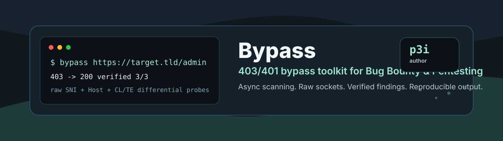

# Bypass

<p align="center">
  
</p>

**Professional 403/401 bypass toolkit for authorized Bug Bounty, Red Team and Pentesting.**

Automates high-yield access-control bypass techniques, ranks the most promising results, verifies findings against fresh baselines, and exports reproducible evidence.

**Author:** p3i

[](https://www.python.org/)
[](https://www.python-httpx.org/)
[](#responsible-use)
[](#output)

## Highlights

- 403/401 bypass automation for paths, headers, methods, query params, protocol variants and auth challenge behavior.
- Real Host/SNI testing with raw sockets for vhost and origin-bypass workflows.
- Smuggling-lite probes over raw sockets, including CL.TE, TE.CL, CL.CL, pause-based probes and reuse timing.
- Async scanning with controlled concurrency, per-host rate limiting and 429/503 backoff.
- Automatic verification of interesting findings against fresh baselines.
- Raw request import from Burp/ZAP-style files.
- Proxy, custom headers, cookies, body, content type, User-Agent, `--resolve` and `--connect-to`.
- JSON/CSV exports with sensitive value redaction.
- Replay mode for previously discovered findings.

## Responsible Use

Use this tool only against systems where you have explicit authorization. It is designed for professional testing workflows, Bug Bounty programs, internal security assessments and lab environments. Respect program scope, rate limits, safe harbor rules and data handling requirements.

## Install

```bash
git clone <repo-url> Bypass
cd Bypass
python3 -m venv .venv
. .venv/bin/activate
pip install -e .
```

Development dependencies:

```bash
pip install -e '.[dev]'
python -m pytest -q
```

If the `bypass` command behaves as if the URL were a subcommand after pulling changes, regenerate the editable install:

```bash
pip install -e .
hash -r
which bypass
```

## Quick Start

Run all default techniques against one protected endpoint:

```bash
bypass https://target.tld/admin
```

Use `-k` for internal labs, self-signed certificates or origin IP tests:

```bash
bypass https://10.0.0.5:8443/admin -k
```

Export evidence:

```bash
bypass https://target.tld/admin -k --json results.json --csv results.csv
```

Quiet mode for focused review:

```bash
bypass https://target.tld/admin -q --top 15
```

## Core Techniques

Bypass currently tests:

| Family | Coverage |
| --- | --- |
| Path mutation | Traversal, encoded slashes, double encoding, null bytes, IIS-style tricks, case variants and suffixes. |
| Header injection | `X-Forwarded-For`, `X-Real-IP`, `X-Original-URL`, `X-Rewrite-URL`, `Forwarded`, trusted proxy headers and parser-confusion variants. |
| Method tampering | `HEAD`, `OPTIONS`, `POST`, `PUT`, `PATCH`, `DELETE`, `PROPFIND`, `TRACE`, mixed-case verbs and method override headers. |
| Query mutation | Parameter pollution, debug/admin hints, encoded/null-byte query values. |
| Protocol switching | HTTP/1.0, HTTP/1.1 and HTTP/2 transport probes. |
| Host/SNI | Raw TLS SNI plus `Host`, `:authority`, `X-Forwarded-Host`, `X-Host` and custom vhost candidates. |
| Smuggling-lite | Raw CL.TE, TE.CL, CL.CL, duplicate header forms, pause-based probes, connection reuse timing and conservative evidence heuristics. |
| Auth challenge | Basic, Bearer, NTLM and Negotiate challenge behavior. |
| Guided combos | High-yield path plus IP headers, method override plus encoded path combinations. |

Default bypass IP values include `127.0.0.1`, `::1`, `10.0.0.1`, `192.168.0.1` and `0.0.0.0`.

## Modes Of Use

### Single Target

```bash
bypass https://target.tld/admin
```

Useful when you already have a suspicious `401`, `403`, `404`, `405` or blocked admin/API route.

### Authenticated Testing

Pass program/session context directly:

```bash
bypass https://target.tld/admin \
  -H 'Authorization: Bearer TOKEN' \
  --cookie 'session=abc123' \
  --user-agent 'Mozilla/5.0'
```

### Burp/ZAP Raw Request Import

Save a raw request to `request.txt`, then run:

```bash
bypass --raw-request request.txt -k
```

You can also provide a base URL explicitly:

```bash
bypass https://target.tld --raw-request request.txt -k
```

The raw request mode extracts method, path, headers and body, then combines them with the bypass payload engine.

### JSON/API Bodies

```bash
bypass https://target.tld/api/admin \
  --method POST \
  --body '{"role":"admin"}' \
  --content-type application/json
```

Read a body from disk:

```bash
bypass https://target.tld/api/admin --method POST --body @body.json --content-type application/json
```

### Proxy Through Burp

```bash
bypass https://target.tld/admin \
  --proxy http://127.0.0.1:8080 \
  -k
```

### Origin And Vhost Testing

Connect to an origin IP while keeping the target `Host` header unless a payload overrides it:

```bash
bypass https://target.tld/admin -k --resolve target.tld:443:10.0.0.5
```

Connect one host:port to a different host:port:

```bash
bypass https://target.tld/admin -k --connect-to target.tld:443:10.0.0.5:8443
```

Add custom host candidates for Host/SNI fuzzing:

```bash
bypass https://target.tld/admin -k \
  --host internal.target.tld \
  --host admin.internal.target.tld \
  --host localhost
```

For HTTP/1.1 Host/SNI payloads, Bypass uses raw sockets so TLS SNI, connection target and HTTP `Host` can diverge in the way origin-bypass testing often requires.

### Controlled Throughput

Default concurrency is `20`.

```bash
bypass https://target.tld/admin --concurrency 20 --rate 10
```

`--rate` is applied per host and the scanner backs off when the target returns `429` or `503`.

### Automatic Verification

Verification is enabled by default. Bypass re-tests interesting findings against fresh baselines and records whether the behavior reproduces.

```bash
bypass https://target.tld/admin --verify --verify-attempts 3 --verify-limit 20
```

Disable it when you need the lowest possible traffic:

```bash
bypass https://target.tld/admin --no-verify
```

### Batch Mode

Scan many URLs:

```bash
bypass batch targets.txt -k --out-dir results/
```

With authenticated context and throttling:

```bash
bypass batch targets.txt \
  -H 'Authorization: Bearer TOKEN' \
  --cookie 'session=abc123' \
  --concurrency 10 \
  --rate 5 \
  --out-dir results/
```

### Replay Mode

Re-test findings from a previous JSON export:

```bash
bypass replay results.json -k --min-confidence medium
```

Replay through a proxy:

```bash
bypass replay results.json -k --proxy http://127.0.0.1:8080
```

## Output

Bypass prints:

1. **Baseline**: reference status, size, calibration and stack profile.
2. **Top bypasses**: ranked findings with score, family, payload, confidence and verification status.
3. **Reproduction commands**: copy-paste `curl` where possible.
4. **Status summaries**: response class distribution and response clusters for noise control.
5. **Full result table**: interesting rows by default, or all rows with `--all`.

Raw socket findings may not be perfectly reproducible with `curl` because the scanner can use exact raw bytes, duplicate headers and custom SNI behavior that normal clients may normalize.

## Exports

JSON:

```bash
bypass https://target.tld/admin --json results.json
```

CSV:

```bash
bypass https://target.tld/admin --csv results.csv
```

On `Ctrl+C`, partial results are written when `--json` or `--csv` is provided.

Sensitive values are redacted from exports, including common token query keys, authorization headers, cookies and common secret patterns.

## CLI Reference

| Flag | Description |
| --- | --- |
| `-k` | Skip TLS certificate verification. |
| `-L` | Follow redirects. |
| `-q`, `--quiet` | Only show the top bypass table and reproduction commands. |
| `--timeout N` | Request timeout in seconds. Default: `15`. |
| `--method M` | HTTP method to test. Repeatable. |
| `-H`, `--header 'K: V'` | Add an extra request header. Repeatable. |
| `--cookie VALUE` | Set the `Cookie` header. |
| `--proxy URL` | Send traffic through an HTTP proxy. |
| `--raw-request FILE` | Load method, path, headers and body from a raw HTTP request. |
| `--resolve H:P:IP` | Connect a host:port to a specific IP while preserving logical host context. |
| `--connect-to H:P:H2:P2` | Connect one host:port to another host:port. |
| `--user-agent VALUE` | Set the `User-Agent` header. |
| `--body VALUE` | Request body text, or `@file` to load bytes from disk. |
| `--content-type VALUE` | Set the `Content-Type` header. |
| `--bypass-ip IP` | Add an IP to the forwarded-IP payload pool. Repeatable. |
| `--host H` | Add a custom host/vhost/SNI candidate. Repeatable. |
| `--json FILE` | Export JSON results. |
| `--csv FILE` | Export CSV results. |
| `--all` | Show/export all visible results instead of only interesting findings. |
| `--rate N` | Max requests per second per host. `0` means unlimited. |
| `--concurrency N` | Max concurrent workers. Default: `20`. |
| `--verify`, `--no-verify` | Enable or disable automatic verification. Default: enabled. |
| `--verify-attempts N` | Re-test attempts per finding. Default: `3`. |
| `--verify-limit N` | Maximum findings to verify. Default: `20`. |
| `--top N` | Number of top findings to print. Default: `10`. |
| `--live-hits`, `--no-live-hits` | Print live 2xx/3xx hits during scanning. |

## Recommended Bug Bounty Workflow

1. Collect candidate endpoints from recon tools, crawler output, JS routes, archived URLs and manual browsing.
2. Filter for blocked or suspicious routes: `401`, `403`, `404`, `405`, redirects to login, WAF blocks and admin/API paths.
3. Start with a low-noise run:

```bash
bypass https://target.tld/admin --rate 5 --concurrency 10 --verify
```

4. Add authenticated context when needed:

```bash
bypass https://target.tld/admin \
  -H 'Authorization: Bearer TOKEN' \
  --cookie 'session=abc123' \
  --proxy http://127.0.0.1:8080 \
  --json results.json
```

5. For CDN/origin cases, add `--resolve`, `--connect-to` and custom `--host` values.
6. Review only verified high-confidence findings first.
7. Replay and manually confirm impact before reporting.

## Development

Run tests:

```bash
. .venv/bin/activate
python -m pytest -q
```

Run lint:

```bash
python -m ruff check src tests
```

Show payload catalog sizes:

```bash
bypass list
```

## Project Status

Bypass is now a strong specialized toolkit for access-control bypass testing. It is not a general-purpose vulnerability scanner; its job is to deeply test the weird boundary between reverse proxies, CDNs, origin routing, method handling, path canonicalization and authentication gates.

## Roadmap

Planned next improvements:

- **Profiles by technology/CDN**: CloudFront/S3/API Gateway/ALB, Nginx/OpenResty, IIS/ASP.NET, Spring/Tomcat, Next.js, Rails/Django/Laravel.
- **Recon ingestion**: native imports from `httpx`, `katana`, `gau`, `waybackurls`, Burp sitemap and Nuclei output.
- **Report generator**: Markdown/HTML report with verified evidence, impact notes, reproduction steps and suggested severity.
- **Nuclei integration**: export verified findings into focused templates or replay checks.
- **More raw smuggling depth**: chained request desync labs, longer-lived reuse experiments and richer timing baselines.
- **Scope guardrails**: allowlist domains, redirect scope enforcement, denylist patterns and per-program traffic profiles.
- **Richer response analysis**: login-page detection, WAF challenge signatures, JSON/HTML structural comparison and normalized body hashing.
- **Async replay and verification**: faster confirmation while keeping per-host safety controls.
- **Plugin payload packs**: external custom payload catalogs per program or technology stack.

## License

Add your preferred license before publishing or distributing the project.
